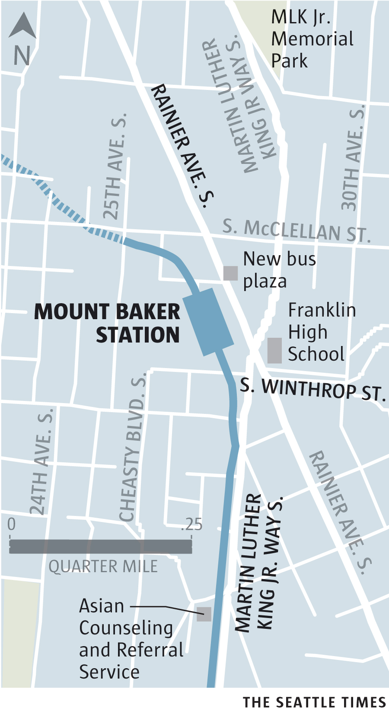

The immediate environment surrounding the elevated Mount Baker Station has a suburban feel, with important Seattle arterials Martin Luther King Jr. Way and Rainier Avenue sprawling below. These two major north-south routes are lined with strip malls and medium-sized box stores, along with only-in-Seattle businesses like the [Oberto Sausage Company](https://www.oberto.com/) and [Borracchini’s Bakery](https://www.nowcake.com/). Coincidentally, Rainier Avenue once served as a thoroughfare for the Rainier Avenue Electric Railway, which connected Seattle with Renton.

<aside class="map"></aside>
 
But also in the shadows of the station is an important and beautiful string of greenbelts to the south and west, which link the Mount Baker neighborhood to Beacon Hill’s Jefferson Park; and just east, near neoclassical Franklin High School, is a meandering greenbelt that follows Mount Baker Boulevard, leading urban wanderers past classic Craftsman-style homes to the shores of Lake Washington’s Mount Baker Beach and Colman Park.
 
Small, yet incredibly popular among locals, [Mount Baker Park](http://www.seattle.gov/parks/find/parks/mount-baker-park) connects the neighborhood to Lake Washington and Colman Park. The park includes tennis courts, a children’s play area and an idyllic setting for a picnic. Nearby, [Mount Baker Community Club](http://www.mountbaker.org/) serves as a community gathering place in an airy, early-20th-century building adjacent to a row of neighborhood businesses. 
