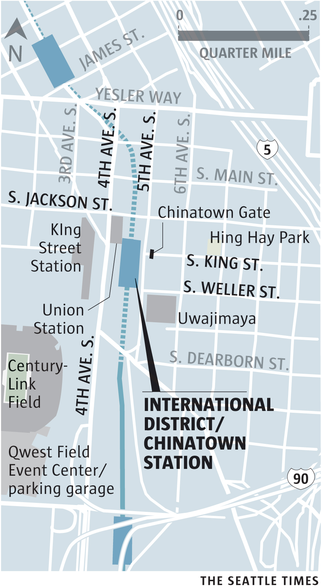

Seattle’s International District-Chinatown Station functions as a crossroads for Seattle’s Asian-American community, and for the city at large. The district is loosely divided into Chinatown, Japantown and Little Saigon neighborhoods.

<aside class="map"></aside>
 
Architecture fans will find much to ogle here, including the historic arched interiors of Union Station, a former Union Pacific train station that now houses Sound Transit and private events. A block to the west lies the recently renovated King Street Station, a “Railroad Italianate” gem serving Amtrak passengers. To the east, visitors pass under the 45-foot-tall, ornate Historic Chinatown Gate.
 
A quick step away to the southeast is [Uwajimaya](http://www.uwajimaya.com/), a popular supermarket owned and operated by Seattle’s Moriguchi family. First operated out of the back of the family’s truck in Tacoma in 1928, it was reopened in Seattle after the family’s internment at Tule Lake, Calif., during World War II. The [store now houses a food court, gift section](http://www.seattletimes.com/life/lifestyle/uwajimaya-a-link-to-tastes-of-home-for-asian-immigrants/) and the Japanese bookstore chain [Kinokuniya](http://www.kinokuniya.com/us/).

Other attractions include the [Wing Luke Museum](http://www.wingluke.org/), an affiliate of the Smithsonian that features rotating exhibitions about the Asian Pacific American experience; Hing Hay Park, where locals play ping pong and games of giant chess; the fortune-cookie factory [Tsue Chong](http://www.seattletimes.com/pacific-nw-magazine/one-family-has-been-making-noodles-at-tsue-chong-for-nearly-100-years/), where you can buy huge bags of imperfect “unfortunate cookies”; and the [Seattle Pinball Museum](http://www.seattletimes.com/life/travel/pinball-wizards-seattle-museum-part-of-revival/). 
 
The International District houses dozens of eateries, including one of the city’s oldest restaurants, [Maneki](http://www.manekirestaurant.com/), which has been serving up Japanese comfort food for more than a century. On the weekend, the neighborhood crawls with people lining up for dim sum, or prowling Little Saigon for affordable, tasty banh mi sandwiches or pho. 