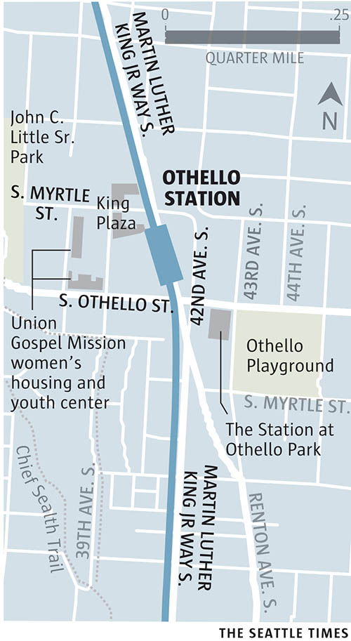

More than 40 languages are spoken in the [Othello neighborhood](http://www.helloothello.com/) — from Amharic to Vietnamese — making it the United Nations of Seattle.

<aside class="map"></aside>
 
The community’s rich cultural diversity is omnipresent, and can be experienced in the businesses and organizations found close to the Othello Station along Martin Luther King Junior Way South: East African and Cambodian grocers and retailers sell familiar products to their respective communities or curious customers; the smells of lemongrass pho, or beef skirt steak carne asada, or pork and shrimp shumai greets pedestrians passing the dozens of restaurants dotting the neighborhood; and throughout the week, you can hear Christian service spoken in Tagalog, or Vietnamese singing coming from the neighborhood’s Buddhist monastery, or prayers in Arabic being recited at a local Islamic school.
 
The Othello Playground and [John C. Little Park](http://www.seattle.gov/parks/find/parks/john-c-little-sr-park) are both a short walk from the Othello Station. They provide great green spaces, making an ideal location to enjoy food and picnic from one of the neighborhood’s many food choices.