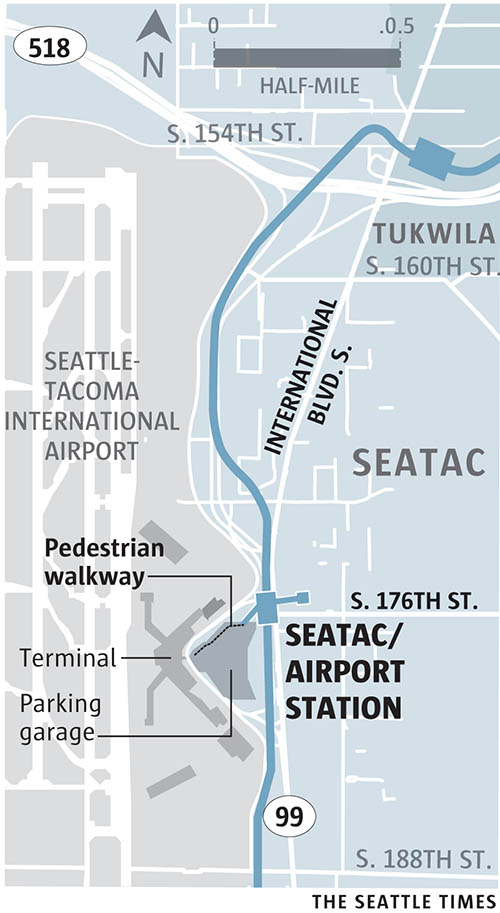

This station serves the rapidly growing [Seattle-Tacoma International Airport](https://www.portseattle.org/Sea-Tac/Pages/default.aspx) and the diverse suburb of SeaTac.

<aside class="map"></aside>
 
Travelers can [experience Seattle and the region](http://seatacshops.com/) without ever stepping outside of the airport: Local musicians perform seven days a week; Puget Sound oysters and salmon are served on several concourses, along with some of the area’s beer and wine; and regional Native American art can be found throughout the terminals.
 
Beyond the airport, the city of SeaTac offers a variety of restaurants that reflect its demographic makeup, including Thai, Japanese and Mexican cuisine. For travelers with an overnight layover, the restaurant [13 Coins](http://www.13coins.com/menus/seattle-seatac-menu/) serves a bucket of clams, smoked-salmon eggs benedict and other menu items 24 hours a day.
