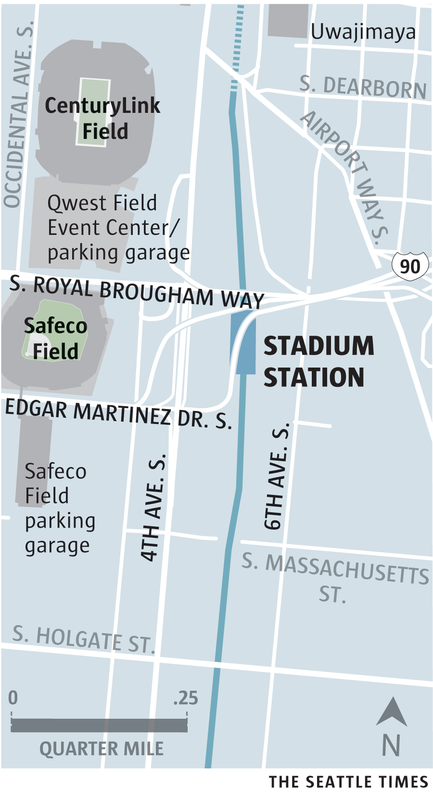

Stadium Station offers easy access to Seattle’s major-league sporting events, including [Mariners games](http://www.seattletimes.com/sports/mariners/) at Safeco Field, and [Sounders FC](http://www.seattletimes.com/sports/sounders/) and [Seahawks games](http://www.seattletimes.com/sports/seahawks/) at CenturyLink Field. 
<aside class="map"></aside>

In 2001, Safeco Field replaced the Kingdome, which was [imploded in grand fashion](http://old.seattletimes.com/special/kingdome/). Its centerfield screen is the second-largest in baseball, as of the 2016 season, and its retractable roof covers nearly 9 acres and contains enough steel to build a 55-story skyscraper.
 
CenturyLink Field once broke a [Guinness World Record](http://www.seattletimes.com/opinion/centurylinks-roar-may-cause-more-than-just-ringing-in-your-ears/) for noise. The stadium’s design, with canopies covering most of the seating, helps to reflect the crowd’s cheers onto the center of the field.
 
Plenty of bars and restaurants cater to thirsty and hungry fans — and to others who work or pass through the growing retail district around the stadiums. Among the options are a southern outpost of the famous [Paseo Caribbean](http://www.seattletimes.com/life/food-drink/paseo-2-opens-in-sodo-and-its-huge/) sandwich shop and [Pyramid Alehouse](http://www.pyramidbrew.com/alehouses/seattle/), a large, popular place to grab a beer with a great Northwest pedigree. 
