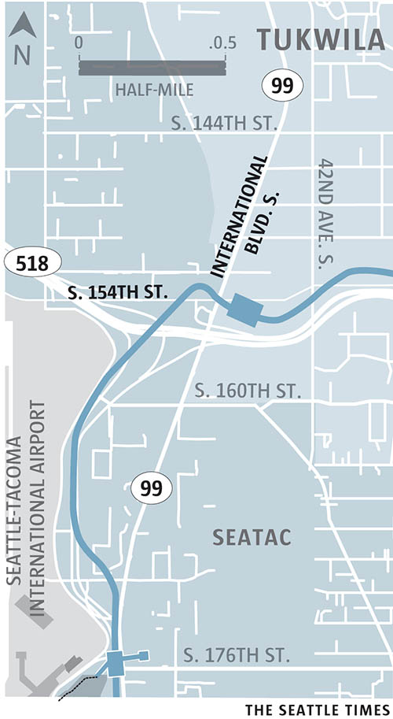

<aside class="map"></aside>

The Tukwila International Boulevard Station is located in the most diverse city in the Pacific Northwest. At nearby Foster High School, [more than 40 world languages are spoken](http://www.seattletimes.com/education-lab/the-revival-of-foster-high-a-school-filled-with-refugees-makes-a-comeback/), and flags from about 50 countries greet students in the cafeteria. Tukwila’s diversity is also illustrated through the many businesses found near the station. At nearby [Bakaro Mall](https://www.youtube.com/watch?v=F-n4akU0XwQ), a wide range of African-made products are sold, including fabrics, jewelry and beauty products. Global cuisine is also found in the shadows of the station, including Indian, Chinese, East African and Mexican food.
 
A quick bus ride from the Tukwila station is [Westfield Southcenter mall](https://www.westfield.com/southcenter). At 1.7 million square feet, it is the largest shopping complex in the state, with more than 200 stores. Dozens of additional retail[ers and restaurants, large and small, anchor the periphery of the mall.
 
For bike and hiking enthusiasts, the [Green River Trail](http://www.kingcounty.gov/services/parks-recreation/parks/trails/regional-trails/popular-trails/green-river.aspx) is about a 15-minute trip from the station. The approximately 20-mile trail hugs the Green River, traversing farmland, industrial and warehouse areas, and suburbs, ending in Seattle. 
